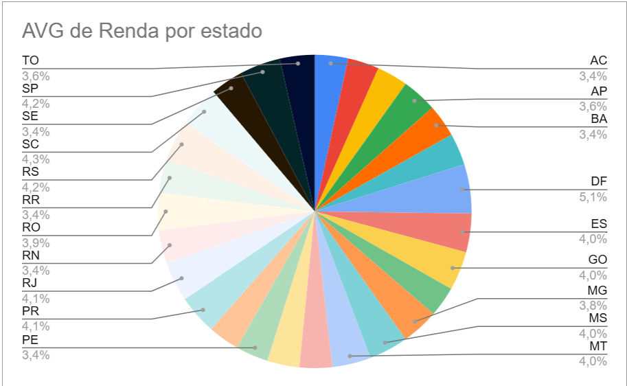
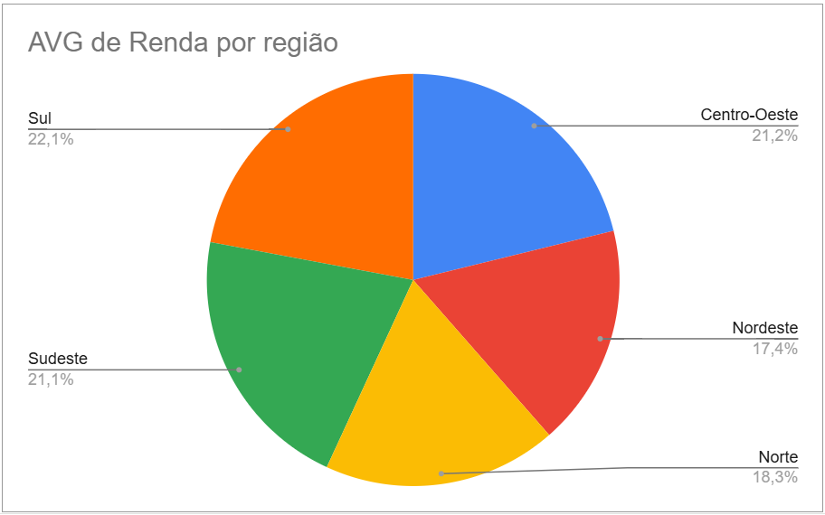
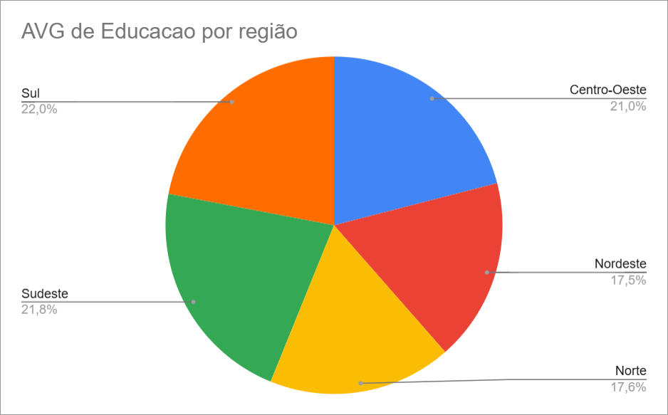

# ✏️ Faça Você Mesmo - Agrupamento de Dados municipios brasileiros

📄 **Exercício do curso Eu ProgrAmo!**  
🔗 [Link para a planilha no Google Sheets](https://docs.google.com/spreadsheets/d/1KHrTv9seTFftyQavFwYrANPyHa906BFHt8y4keFd_j4/edit?usp=sharing)

## 🎯 Objetivo

Explorar os dados da planilha e realizar um agrupamento por estado e região, observando a distribuição de renda e educação.

## 🔍 O que foi feito

- Agrupamento por estado usando Tabela Dinâmica
- Agrupamento por região usando Tabela Dinâmica
- Criado gráfico de pizza para visualizar a distribuição média de renda e educação tanto por estado quanto por regiões
- Foram respondidas as perguntas:
 Respondam as perguntas: 
- Que tipo de informação conseguiram tirar com esse agrupamento? 
    Média de renda por estado ou região, média de educação por estado ou região, correlação entre renda e educação, diferenças regionais, entre outras.
- Qual é a região com os melhores índices de educação? 
    A região com os melhores índices de educação é a região sul
- A região com os melhores índices de educação, é a mesma que tem os melhores de renda? E o estado? 
    Sim, a região sul é a região com os melhores índices de educação e de renda
- O melhor estado está dentro da melhor Região também?
    Não, o melhor estado é o DF tanto em renda quanto em educação e ele pertence a região centro oeste

## 📈 Visualização

*(Se quiser, você pode dar print no gráfico que fez no Sheets e salvar na pasta `imagens/`, colocando aqui uma imagem ou o link direto)*

## 💬 Conclusões e percepções iniciais

Essas são algumas observações e hipóteses que surgiram a partir da análise feita até agora.  
Estou aberta a feedbacks, sugestões de novas formas de agrupar ou visualizar os dados, e outras interpretações possíveis! ✨  
Sinta-se à vontade para contribuir ou compartilhar sua visão. 🚀

